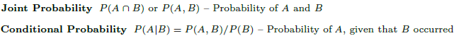

```{r setup, include=FALSE}
knitr::opts_chunk$set(comment = NA, echo=TRUE, message = FALSE, warnings = FALSE)
```
```{r set-options, echo=FALSE, cache=FALSE}
options(width = 3000)
```

```{r}
library(dplyr )
library(tidyr)
library(MASS)
library(psych)
library(ggplot2)
library(gridExtra)
```
### <span style="color:red"><b>Final Project</b></span>
<div id="FinalExam.01"></div>
```{r}
houseprices_complete_df <- read.csv(file="data/train.csv", head=TRUE,  sep=",", stringsAsFactors = FALSE)
test_df <- read.csv(file="data/test.csv", head=TRUE,  sep=",", stringsAsFactors = FALSE)

colnames(houseprices_complete_df)
nrow(houseprices_complete_df)
ncol(houseprices_complete_df)

colnames(test_df)
nrow(test_df)
ncol(test_df)

houseprices_df = dplyr::select(houseprices_complete_df, matches("Id|LotArea|OverallQual|YearBuilt|TotalBsmtSF|GrLivArea|SalePrice"))

X <- houseprices_df$GrLivArea
Y <- houseprices_df$SalePrice

head(houseprices_df, 20)
tail(houseprices_df, 20)

summary(X)
summary(Y)

```
<div id="Seperator01"></div>

##### <span style="color:red"><b><u>(1) Probability:</u></b></span>
<div id="FinalExam.02"></div>
```{r}

x_quantile <- quantile(X)
y_quantile <- quantile(Y)
x_quantile
y_quantile

# 1st quartile for X
x <- quantile(X, probs = 0.25)

# 2nd quartile for Y
y <- quantile(Y, probs = 0.50)

c(x, y)

vTotal = nrow(houseprices_df)
vX = nrow(filter(houseprices_df, (X>x)))
vY = nrow(filter(houseprices_df, (Y>y)))
vXgYg = nrow(filter(houseprices_df, (X>x & Y>y)))
vXlYg = nrow(filter(houseprices_df, (X<x & Y>y)))

c(vTotal, vX, vY, vXgYg, vXlYg)

c(round(vXgYg/vY, 5), round(vXgYg/vTotal, 5), round(vXlYg/vY, 5), round(vXgYg/vTotal, 5), round(vX/vTotal, 5), round(vY/vTotal, 5))

```
<div id="FinalExam.21"></div>

$A = (X>x)$ <br>
$B = (Y>y)$ <br>
$(a) P(X>x | Y>y) = \frac{P(X>x \& Y>y)}{P(Y>y)}$ <br><br>
$(b) P(X>x \& Y>y) = \frac{P(X>x \& Y>y)}{total cases}$ <br><br>
$(c) P(X<x | Y>y) = \frac{P(X<x \& Y>y)}{P(Y>y)}$ <br><br>

a) P(X>x | Y>y) Conditional Probability
Probability X(GrLivArea) is greater than x given Y(SalePrice) is greater than y

b) P(X>x & Y>y) Joint Probability
Probability X(GrLivArea) is greater than x and Y(SalePrice) is greater than y

c) P(X<x | Y>y) Conditional Probability
Probability X(GrLivArea) is less than x given Y(SalePrice) is greater than y

<table border="1">
<tr>
  <td align="center" style='width: 100px'></td>
  <td align="center" style='width: 100px'></td>
  <td align="center" style='width: 100px'></td>
  <td align="center" style='width: 100px'></td>
  <td align="center" style='width: 100px'></td>
</tr>
<tr>
  <td align="center" style='width: 100px'><span style="color:red"><b>(a)</b></span></td>
  <td align="center" style='width: 100px'>$P(X>x | Y>y)$</td>
  <td align="center" style='width: 100px'>$\frac{P(X>x \& Y>y)}{P(Y>y)}$</td>
  <td align="center" style='width: 100px'>$\frac{`r I(vXgYg)`}{`r I(vY)`}$</td>
  <td align="center" style='width: 100px'>$`r I(round(vXgYg/vY, 5))`$</td>
</tr>
<tr>
  <td align="center" style='width: 100px'><span style="color:red"><b>(b)</b></span></td>
  <td align="center" style='width: 100px'>$P(X>x \& Y>y)$</td>
  <td align="center" style='width: 100px'>$\frac{P(X>x \& Y>y)}{total cases}$</td>
  <td align="center" style='width: 100px'>$\frac{`r I(vXgYg)`}{`r I(vTotal)`}$</td>
  <td align="center" style='width: 100px'>$`r I(round(vXgYg/vTotal, 5))`$</td>
</tr>
<tr>
  <td align="center" style='width: 100px'><span style="color:red"><b>(c)</b></span></td>
  <td align="center" style='width: 100px'>$P(X<x | Y>y)$</td>
  <td align="center" style='width: 100px'>$\frac{P(X<x \& Y>y)}{P(Y>y)}$</td>
  <td align="center" style='width: 100px'>$\frac{`r I(vXlYg)`}{`r I(vY)`}$</td>
  <td align="center" style='width: 100px'>$`r I(round(vXlYg/vY, 5))`$</td>
</tr>
</table>
<br>

<table border="1">
<tr>
  <td align="center" style='width: 100px'>$P(X)$</td>
  <td align="center" style='width: 300px'>$P(X>x)$</td>
  <td align="center" style='width: 300px'>$\frac{`r I(vX)`}{`r I(vTotal)`}$</td>
  <td align="center" style='width: 100px'>$`r I(round(vX/vTotal, 5))`$</td>
</tr>
<tr>
  <td align="center" style='width: 100px'>$P(Y)$</td>
  <td align="center" style='width: 300px'>$P(Y>y)$</td>
  <td align="center" style='width: 300px'>$\frac{`r I(vY)`}{`r I(vTotal)`}$</td>
  <td align="center" style='width: 100px'>$`r I(round(vY/vTotal, 5))`$</td>
</tr>
<tr>
  <td align="center" style='width: 100px'>$P(X)P(Y)$</td>
  <td align="center" style='width: 300px'>$P(X)*P(Y)$</td>
  <td align="center" style='width: 300px'>$\frac{`r I(vX)`}{`r I(vTotal)`}$*$\frac{`r I(vY)`}{`r I(vTotal)`}$</td>
  <td align="center" style='width: 100px'>$`r I(round((vX*vY)/(vTotal*vTotal), 5))`$</td>
</tr>
<tr>
  <td align="center" style='width: 100px'>$P(XY)$</td>
  <td align="center" style='width: 300px'>$P(X>x | Y>y)$ X $P(Y>y)$</td>
  <td align="center" style='width: 300px'>$`r I(round(vXgYg/vY, 5))`$ X $`r I(round(vY/vTotal, 5))`$</td>
  <td align="center" style='width: 100px'>$`r I(round(vXgYg/vTotal, 5))`$</td>
</tr>
</table>

<br>
If $X$ and $Y$ are independent events, the probability of this event happening can be calculated as shown below: <br>
$P(X \cap Y)$ = $P(X)$ X $P(Y)$ <br>
This can also be written as <br>
$P(XY)$  = $P(X)P(Y)$ <br>
This condition can be met when $X$ and $Y$ are independent.<br><br>

$P(XY)$ = $P(X>x \& Y>y)$ <br>
$P(X>x \& Y>y)$ = $P(X>x | Y>y)$ X $P(Y>y)$ <br>
$P(X>x \& Y>y)$ = $`r I(round(vXgYg/vY, 5))`$ X $`r I(round(vY/vTotal, 5))`$ = $`r I(round((vXgYg*vY)/(vY*vTotal), 5))`$ <br>

Does splitting the training data in this fashion make them independent? In other words, does P(XY)=P(X)P(Y) or does P(X|Y) = P(X)?<br>
From the above calculation, we can see that splitting the data does not make $X$ and $Y$ independent.

```{r}
#1st quartile 
xq1 = x_quantile[["25%"]]

#2d quartile 
yq2 = y_quantile[["50%"]]

q1 = nrow(filter(houseprices_df, (Y >  yq2 & X >  xq1)))/nrow(houseprices_df)
q2 = nrow(filter(houseprices_df, (Y >  yq2 & X <= xq1)))/nrow(houseprices_df)
q3 = nrow(filter(houseprices_df, (Y <= yq2 & X >  xq1)))/nrow(houseprices_df)
q4 = nrow(filter(houseprices_df, (Y <= yq2 & X <= xq1)))/nrow(houseprices_df)

c(q1, q2, q3, q4)

chisqMatrix <- matrix(c(q1, q2, q3, q4) , nrow=2, ncol=2 )
chisqMatrix
chisq.test(chisqMatrix)
```
We accept the null hypothysis that there in no relationship between X and Y.

<div id="Seperator02"></div>

##### <span style="color:red"><b><u>(2) Descriptive and Inferential Statistics:</u></b></span>
<div id="FinalExam.03"></div>
```{r}
ggplot(houseprices_df, aes(x=houseprices_df$SalePrice)) + geom_histogram(colour="black", fill="green") + 
  scale_x_continuous(labels = scales::comma) + xlab("SalePrice") + ggtitle("SalePrice Histogram")

ggplot(data=houseprices_df) + geom_density(aes(x=houseprices_df$GrLivArea), fill="blue") + 
  scale_y_continuous(labels = scales::comma) + xlab("GrLivArea") + ggtitle("Living Area Density")

ggplot(data=houseprices_df, aes(x=houseprices_df$GrLivArea, y=houseprices_df$SalePrice) ) + 
  geom_point(colour="red", size=2) + scale_y_continuous(labels = scales::comma) +
  xlab("GrLivArea") + ylab("SalePrice") +
  ggtitle("GrLivArea vs. SalePrice")

ggplot(data=houseprices_df, aes("GrLivArea", GrLivArea)) + geom_boxplot(fill="green") + 
  scale_y_continuous(labels = scales::comma) + ggtitle("GrLivArea")

ggplot(data=houseprices_df, aes("SalePrice", SalePrice)) + geom_boxplot(fill="green") + 
  scale_y_continuous(labels = scales::comma) + ggtitle("SalePrice")

model <- lm(houseprices_df$SalePrice ~ houseprices_df$GrLivArea, data=houseprices_df)
bc <- boxcox(model,lambda=seq(-0.5,0.5,by=0.01))

lambda<-bc$x[which.max(bc$y)]
lambda

houseprices_df["SalePrice_hat"] <- houseprices_df["SalePrice"]^lambda
new_model <- lm(SalePrice_hat ~ houseprices_df$GrLivArea, data=houseprices_df)

summary(model)
summary(new_model)
```

```{r}
qqnorm(houseprices_df[,"SalePrice_hat"])
qqline(houseprices_df[,"SalePrice_hat"])
```

```{r}
qqnorm(houseprices_df[,"SalePrice"])
qqline(houseprices_df[,"SalePrice"])
```

```{r}
plot(new_model$fitted.values, new_model$residuals, xlim = c(.53,.55))
title("Residual vs Fitted New Model")
```

```{r}
plot(model$fitted.values, model$residuals, xlim = c(100000,300000))
title("Residual vs Fitted  Model")
```
<br>

```{r}
cor.test(houseprices_df[,"GrLivArea"], houseprices_df[,"SalePrice"], conf.level = .99)
```


```{r}
cor.test(houseprices_df[,"GrLivArea"], houseprices_df[,"SalePrice_hat"], conf.level = .99)
```

<div id="Seperator03"></div>

##### <span style="color:red"><b><u>(3) Linear Algebra and Correlation:</u></b></span>
<div id="FinalExam.04"></div>
```{r}
correlationMatrix <- cor(houseprices_df[, c('LotArea','OverallQual', 'YearBuilt', 'TotalBsmtSF','GrLivArea', 'SalePrice')])
correlationMatrix

precisionMatrix <- solve(correlationMatrix)
precisionMatrix

round(correlationMatrix %*% precisionMatrix)
round(precisionMatrix %*% correlationMatrix)
```


<div id="Seperator04"></div>

##### <span style="color:red"><b><u>(4) Calculus-Based Probability & Statistics:</u></b></span>
<div id="FinalExam.05"></div>
```{r}
distr1 <- fitdistr(houseprices_df$GrLivArea, densfun="exponential")

l <- distr1$estimate
xsamp <- rexp(1000,l)

sampleHistogram <- qplot(xsamp, geom='histogram', binwidth=250) + xlab("Sampled")
originalHistogram <- qplot(houseprices_df$GrLivArea, geom='histogram', binwidth=100) + xlab("Original")
grid.arrange(sampleHistogram, originalHistogram, ncol=2)

```
<div id="Seperator05"></div>

##### <span style="color:red"><b><u>(5) Modeling:</u></b></span>
<div id="FinalExam.06"></div>

I have selected the following predictor/response variables:

Predictor variables
<li>OverallQual: Rates the overall material and finish of the house</li>
<li>YearBuilt: Original construction date</li>
<li>GrLivArea: Above grade (ground) living area square feet</li>
<br>
Response variables
<li>SalePrice: Property's sale price in dollars</li>

##### <span style="color:blue"><b><u>(5.1) Create a function to calculate the correlation and round it to 4 decimal digits:</u></b></span>
```{r}
findCorrelation <- function() {
  corr = round(cor(houseprices_df$GrLivArea, houseprices_df$SalePrice),4)
  print (paste0("Correlation = ",corr))
  return (corr)
}
c = findCorrelation()
```


##### <span style="color:blue"><b><u>(5.2) Create functions to calculate the slope and the intercept:</u></b></span>
```{r}
getSlope <- function(m) {
  slp = round(m$coefficients[2], 4)
  return (slp)
}

getIntercept <- function(m) {
  int = round(m$coefficients[1], 4)
  return (int)
}
```

##### <span style="color:blue"><b><u>(5.3) Create Regression model:</u></b></span>

```{r}
houseprices_model_df = dplyr::select(houseprices_complete_df, matches("GrLivArea|OverallQual|YearBuilt|SalePrice"))

plot(houseprices_model_df, pch=16, col="red", main="Scatterplot of HousePrice variables")

nrow(houseprices_model_df)
m1 <- lm (SalePrice ~ . , data = houseprices_model_df)
summary(m1)
```

<span style="color:green"><b>
\[
  \hat{SalePrice} = `r round(m1$coefficients[1], 4)` + (`r round(m1$coefficients[2], 4)` * OverallQual) +
  (`r round(m1$coefficients[3], 4)` * YearBuilt) + (`r round(m1$coefficients[4], 4)` * GrLivArea)
\]
</b></span>


##### <span style="color:blue"><b><u>(5.4) Model Summary:</u></b></span>
We observe that the model has an adjusted $R^2$ value of 0.7368. We also see that the residuals tend to remain constant as we move to the right. Additionally, the residuals are uniformly scattered (except a few outliers) above and below zero. Overall, this plot tells us that using the GrLiveArea, OverallQual and YearBuilt as the predictors of the SalePrice in the regression model explains the data. Therefore, we can conclude that the linear model is appropriate in this case.

##### <span style="color:blue"><b><u>(5.5) Residual Analysis:</u></b></span>
```{r}
c1 <- round(m1$coefficients[1], 4)
c2 <- round(m1$coefficients[2], 4)
c3 <- round(m1$coefficients[3], 4)
c4 <- round(m1$coefficients[4], 4)
c(c1, c2, c3, c4)

ggplot(m1, aes(.fitted, .resid)) + 
  geom_point(color = "brown", size=2) +
  labs(title = "Fitted Values vs Residuals") +
  labs(x = "Fitted Values") +
  labs(y = "Residuals")

```
<br>

##### <span style="color:blue"><b><u>(5.6) Kaggle Submission:</u></b></span>
```{r}
output <- predict(m1, test_df)
submission_df <- data.frame(Id=test_df$Id, SalePrice=output)
submission_df[submission_df < 0] <- 0
head(submission_df, 20)
write.csv(submission_df, file="submissionA_S.csv", row.names = FALSE, quote = FALSE, append = FALSE)
```
The file submissionA_S.csv was submitted to Kaggle and the score is 0.61514. The following is my username and score. The file is also uploaded to my github account https://github.com/asajjad1234/DATA-605

<div id="KaggleSubmission"></div>
<br>
